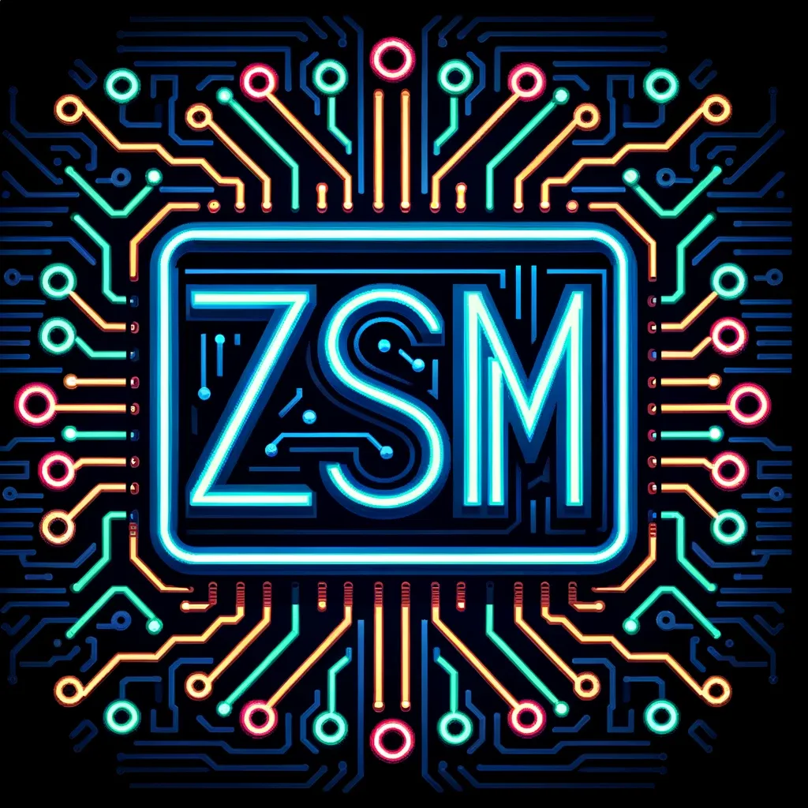

# Zsolt Márku - Personal Portfolio Website



## Overview

This is a personal portfolio website showcasing my skills, projects, and professional background. The website is designed to be responsive, interactive, and multilingual (English, Dutch, and Hungarian).

## Features

- **Multi-language Support**: Switch between English, Dutch, and Hungarian
- **Dark/Light Mode**: Toggle between dark and light themes
- **Responsive Design**: Optimized for all device sizes
- **Interactive Elements**: Animated sections and dynamic content
- **Project Showcase**: Display of various web development projects
- **Contact Form**: Direct communication option with form submission
- **Modern UI**: With stylish wave dividers between sections
- **Dynamic Content Loading**: Content is loaded based on selected language

## Technologies Used

### Frontend
- HTML5
- CSS3
- JavaScript (ES6+)
- Typed.js (for text animation)
- ScrollReveal (for scroll animations)
- BoxIcons & Devicons (icon libraries)

### Tools & Libraries
- Box Icons
- Devicons
- Font Awesome
- Iconify

## Project Structure

```
portfolio/
│
├── index.html              # Main HTML file
├── css/
│   └── styles.css          # Main stylesheet
│
├── js/
│   ├── dynamic-content.js  # Dynamic content loader
│   ├── script.js           # Main JavaScript functionality
│   ├── translations.js     # Multi-language support
│   └── typedContent.js     # Text animation configuration
│
├── images/
│   ├── favicon.webp        # Site favicon
│   ├── my_logo.webp        # Personal logo
│   ├── flags/              # Language flag icons
│   ├── photos/             # Profile photos
│   └── previews/           # Project preview images
│
└── projects/               # Individual project folders
    ├── ampcocutting/       # AMPCO Cutting Time Calculator
    ├── dishcovery/         # Recipe discovery app
    ├── guccoaching/        # G.U.C. Coaching landing page
    ├── merrychristmas/     # Digital Christmas Card
    ├── mynotes/            # MyNotes Web App
    └── nexatrust/          # NexaTrust Banking App
```

## Projects Showcased

1. **Simon Game**: A memory skill game
2. **Digital Christmas Card**: Interactive holiday greeting
3. **MyNotes Web-App**: Note-taking application built with React
4. **To Do List Web-App**: Task management application
5. **Authentication Web-App**: User authentication system
6. **Blog Web-App**: Content management system
7. **Newsletter SignUp**: Email subscription with API integration
8. **AMPCO Cutting Time Calculator**: Industry-specific calculation tool
9. **AMPCO Plate Cutting Time Calculator**: Advanced calculation tool with Python backend
10. **NexaTrust Banking App**: Banking interface demonstration
11. **G.U.C. Coaching**: Landing page for a coaching service built with Tailwind CSS
12. **Dishcovery**: Recipe discovery and browsing application

## Design Elements

- **Wave Dividers**: Custom SVG wave dividers create a modern flow between sections
- **Dynamic Theme Switching**: Light/dark mode with animated toggle
- **Responsive Navigation**: Mobile-friendly menu with hamburger icon
- **Animated Skill Bars**: Visual representation of skill proficiency
- **Interactive Project Cards**: Hover effect reveals project details and technologies

## Setup and Installation

1. Clone the repository:
```
git clone https://github.com/KipSter91/portfolio.git
```

2. Navigate to the project directory:
```
cd portfolio
```

3. Open index.html in your browser or use a local server:
```
# Using Python's built-in server
python -m http.server
```

4. Visit `http://localhost:8000` in your web browser

## Future Enhancements

- Adding more interactive elements
- Implementing a blog section
- Performance optimizations
- Adding more project showcases
- Accessibility improvements

## Contact

Feel free to reach out to me through the contact form on the website or via:

- LinkedIn: [Zsolt Márku](https://linkedin.com/in/zsolt-márku-931a49298)
- GitHub: [KipSter91](https://github.com/KipSter91/)
- Twitter: [@MarkuZsolt](https://twitter.com/MarkuZsolt)

## License

This project is licensed under the MIT License - see the LICENSE file for details.

---

© 2023-2025 Zsolt Márku. All Rights Reserved.